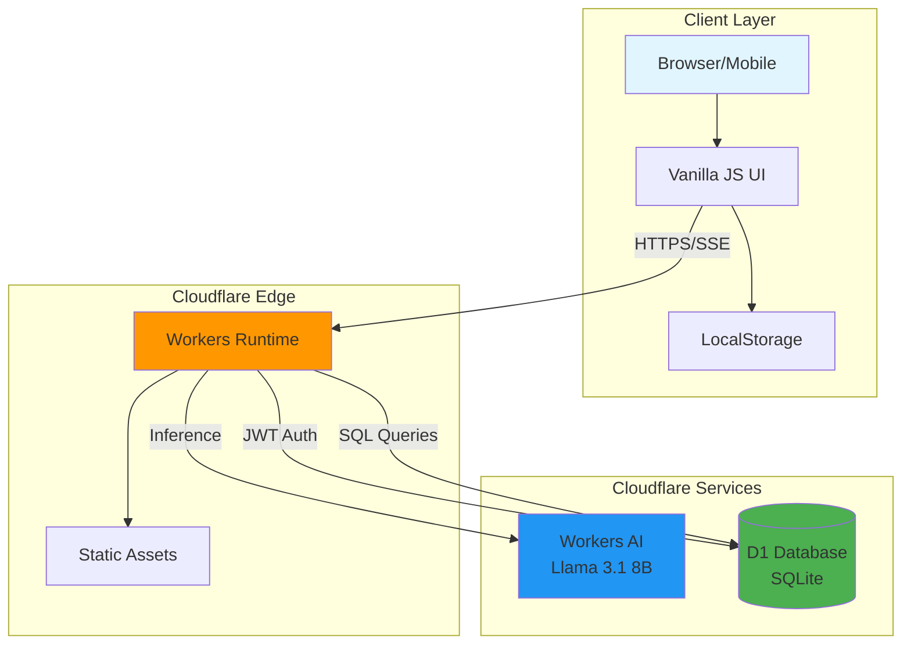

# Today's Horoscope

[](https://opensource.org/licenses/MIT)
[](https://www.typescriptlang.org/)
[](https://workers.cloudflare.com/)
[](https://developers.cloudflare.com/d1/)
[](https://developers.cloudflare.com/workers-ai/)

> 생년월일 기반 운세 분석을 제공하는 서버리스 AI 채팅 애플리케이션

Cloudflare Workers AI와 D1 Database를 기반으로 구축된 풀스택 한국어 운세 챗봇입니다. 실시간 스트리밍 응답과 안전한 사용자 인증을 제공하며, 완전히 서버리스 아키텍처로 설계되었습니다.

**[Live Online Demo](https://kalpha.c01.kr)** | [GitHub](https://github.com/gguatit/Today-s-horoscope)

## Table of Contents

- [Architecture](#architecture)
- [Features](#features)
- [Tech Stack](#tech-stack)
- [Security](#security)
- [API Reference](#api-reference)
- [Database Schema](#database-schema)
- [License](#license)

## Architecture



### Request Flow

1. **Client Request**: 사용자가 브라우저에서 운세를 요청
2. **Authentication**: JWT 토큰 검증 및 사용자 정보 조회
3. **AI Processing**: Llama 3.1 8B 모델을 사용한 운세 생성
4. **Streaming Response**: SSE(Server-Sent Events)를 통한 실시간 응답 전송
5. **State Persistence**: LocalStorage에 채팅 기록 및 세션 저장

## Features

### AI-Powered Horoscope Analysis

- **Llama 3.1 8B Instruct FP8** 모델 기반 운세 생성
- 생년월일과 목표 날짜를 기반으로 한 맞춤형 분석
- **12별자리(서양 점성술)** 완전 통합 ✅
  - 자동 별자리 계산 및 UI 표시
  - 별자리별 세부 특성 (열정, 안정, 소통, 감성, 자신감, 세심함, 균형, 직관, 모험, 목표, 독창성, 상상력) AI 운세에 자연스럽게 통합
  - 12개 별자리(양자리~물고기자리) 각각의 강점과 주의사항 맞춤 반영
  - `ZODIAC_SIGNS` 상수 배열로 관리 (`src/types.ts`)
- 긍정적/부정적 조언의 균형잡힌 제공 (70% 긍정, 30% 주의)
- **간결한 운세 형식**: "오늘 당신의 운세는 '<한 줄 요약>' 입니다." 형식 사용
  - 예: "오늘 당신의 운세는 '새로운 기회가 찾아온다' 입니다."
- 환각(hallucination) 방지를 위한 시스템 프롬프트 최적화
- 한국어 전용 응답 및 문법 교정

### Real-time Interaction

- **Server-Sent Events (SSE)** 기반 스트리밍 응답
- 타이핑 인디케이터로 AI 응답 상태 표시
- 비동기 처리로 부드러운 사용자 경험 제공

### User Management

- JWT 기반 무상태 인증 시스템
- 회원가입/로그인 기능
- 사용자별 생년월일 정보 자동 연동
- 세션 유지 및 자동 로그인

### User Experience

- 모바일 최적화 UI (숫자 키패드 입력 지원)
- 날짜 증감 버튼으로 편리한 날짜 조정
- '오늘' 버튼으로 빠른 날짜 초기화
- **12별자리 자동 표시** ✅ (생년월일 설정 시 채팅창에 실시간 표시)
  - 별자리 아이콘 + 한국어명 + 영어명 + 날짜 범위
  - 실시간 계산 및 업데이트
- LocalStorage 기반 채팅 기록 및 설정 유지
- 비밀번호 표시/숨김 토글
- 반응형 디자인 (모바일/태블릿/데스크톱)

## Tech Stack

### 프론트엔드 (Frontend)
- **언어**: Vanilla JavaScript (ES6+), HTML5, CSS3
- **프레임워크**: 없음 (순수 JavaScript)
- **상태 관리**: LocalStorage
- **실시간 통신**: Server-Sent Events (SSE)
- **UI 특징**: 반응형 디자인, 모바일 최적화

### 백엔드 (Backend)
- **언어**: TypeScript 5.8
- **런타임**: Cloudflare Workers (V8 Engine)
- **AI 모델**: Llama 3.1 8B Instruct FP8 (@cf/meta/llama-3.1-8b-instruct-fp8)
- **데이터베이스**: Cloudflare D1 (SQLite 기반)
- **인증**: Custom JWT (HS256, Web Crypto API)
- **비밀번호 암호화**: PBKDF2-HMAC-SHA256 (100,000 iterations)

### 인프라 & 서비스
- **호스팅**: Cloudflare Workers (Edge Computing)
- **데이터베이스**: Cloudflare D1 (Serverless SQLite)
- **AI 추론**: Cloudflare Workers AI
- **정적 자산**: Cloudflare Workers Assets
- **아키텍처**: 완전 서버리스 (Serverless)

## Security

### Authentication & Authorization

**JWT-based Stateless Authentication**
- HS256 알고리즘을 사용한 JWT 서명
- 사용자 ID, 사용자명, 생년월일 페이로드 포함
- 토큰 기반 세션 관리로 확장성 보장

```typescript
// JWT payload structure
{
  sub: number,        // User ID
  username: string,   // Username
  birthdate: string   // User birthdate (YYYYMMDD)
}
```

### Password Security

**PBKDF2 Key Derivation**
- 알고리즘: PBKDF2 with HMAC-SHA256
- 반복 횟수: 100,000 iterations
- 솔트: 사용자별 고유 UUID
- 키 길이: 256 bits (AES-GCM)

```typescript
// Password hashing implementation
- Salt generation: crypto.randomUUID()
- Key derivation: PBKDF2 + HMAC-SHA256
- Iterations: 100,000
- Output: Base64 encoded hash
```

### SQL Injection Prevention

**Parameterized Queries**
- 모든 데이터베이스 쿼리에 prepared statements 사용
- `prepare().bind()` 패턴으로 입력값 바인딩
- 사용자 입력값 직접 연결 금지

```typescript
// Example: Secure query pattern
await env.DB.prepare("SELECT * FROM users WHERE username = ?")
  .bind(username)
  .first();
```

### XSS Protection

**Input Sanitization**
- HTML 특수문자 이스케이프 처리
- `<`, `>`, `&`, `"`, `'` 문자 변환
- 사용자 입력값 반영 시 sanitize 함수 적용

```typescript
// Sanitization function
function sanitize(str: string): string {
  return str.replace(/[&<>"']/g, (match) => {
    const escape = {
      '&': '&amp;', '<': '&lt;', '>': '&gt;',
      '"': '&quot;', "'": '&#39;'
    };
    return escape[match];
  });
}
```

### Input Validation

**User ID Requirements**
- 형식: 영문/숫자 조합
- 길이: 4-8자
- 정규식: `^[a-zA-Z0-9]{4,8}$`

**User Name Requirements**
- 길이: 2-4자
- 모든 문자 허용 (한글, 영문 등)

**Password Requirements**
- 길이: 8-20자
- 모든 문자 허용

## API Reference


### Authentication Endpoints

#### POST `/api/auth/register`

사용자 회원가입

**Request Body**
```json
{
  "userId": "string (4-8 chars, alphanumeric)",
  "userName": "string (2-4 chars, required)",
  "password": "string (8-20 chars)",
  "birthdate": "string (YYYYMMDD, optional)"
}
```

**Response**
```json
{
  "success": true
}
```

**Error Codes**
- `400`: Invalid input format
- `409`: User ID already exists
- `500`: Server error

#### POST `/api/auth/login`

사용자 로그인

**Request Body**
```json
{
  "userId": "string",
  "password": "string"
}
```

**Response**
```json
{
  "token": "string (JWT)",
  "userId": "string",
  "userName": "string",
  "birthdate": "string | null"
}
```

**Error Codes**
- `400`: Missing credentials
- `401`: Invalid user ID or password
- `500`: Server error

### Chat Endpoint

#### POST `/api/chat`

AI 채팅 요청 (SSE 스트리밍)

**Request Body**
```json
{
  "messages": [
    {
      "role": "user",
      "content": "string"
    }
  ]
}
```

**Response**
- Content-Type: `text/event-stream`
- Streaming SSE format with AI-generated response

**Error Codes**
- `405`: Method not allowed
- `500`: AI processing error

## Database Schema

```sql
CREATE TABLE users (
  id INTEGER PRIMARY KEY AUTOINCREMENT,
  user_id TEXT NOT NULL UNIQUE,
  user_name TEXT NOT NULL,
  password_hash TEXT NOT NULL,
  salt TEXT NOT NULL,
  birthdate TEXT,
  created_at TIMESTAMP DEFAULT CURRENT_TIMESTAMP,
  last_login TIMESTAMP,
  location TEXT,
  total_requests INTEGER DEFAULT 0
);
```

## License

MIT License - see [LICENSE](LICENSE) file for details

---

**Built with ❤️ using:**
- [Cloudflare Workers](https://workers.cloudflare.com/) - Edge computing platform
- [Cloudflare D1](https://developers.cloudflare.com/d1/) - Serverless SQLite database
- [Workers AI](https://developers.cloudflare.com/workers-ai/) - Llama 3.1 8B Instruct FP8
- Vanilla JavaScript - No frontend frameworks
- TypeScript 5.8 - Type safety

**프로젝트 현황:**
- ✅ 핵심 운세 챗봇 기능 완성
- ✅ 12별자리 통합 완료 (계산, UI 표시, AI 특성 반영)
- ✅ JWT 인증 및 PBKDF2 보안
- ✅ SSE 실시간 스트리밍
- ✅ 모바일 최적화 UI
- 🚧 자동화 테스트 (향후 추가 예정)

**Live Demo**: [https://kalpha.c01.kr](https://kalpha.c01.kr)
