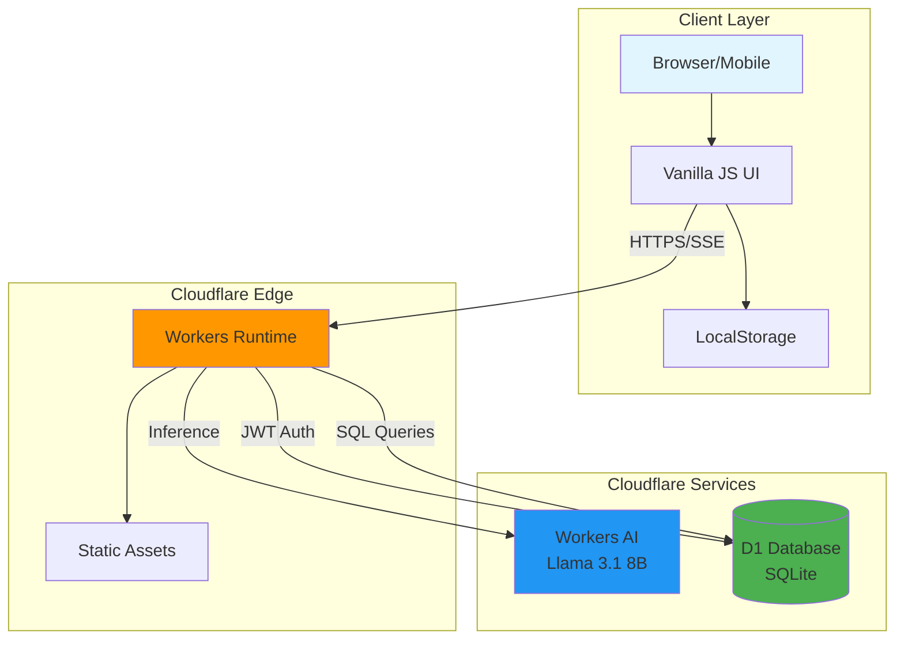

# Today's Horoscope

[](https://opensource.org/licenses/MIT)
[](https://www.typescriptlang.org/)
[](https://workers.cloudflare.com/)

> 생년월일 기반 운세 분석을 제공하는 서버리스 AI 채팅 애플리케이션

Cloudflare Workers AI와 D1 Database를 기반으로 구축된 풀스택 한국어 운세 챗봇입니다. 실시간 스트리밍 응답과 안전한 사용자 인증을 제공하며, 완전히 서버리스 아키텍처로 설계되었습니다.

**[Live Demo](https://kalpha.c01.kr)** | [GitHub](https://github.com/gguatit/Today-s-horoscope)

## Table of Contents

- [Architecture](#architecture)
- [Features](#features)
- [Tech Stack](#tech-stack)
- [Security](#security)
- [Getting Started](#getting-started)
- [Project Structure](#project-structure)
- [API Reference](#api-reference)
- [License](#license)

## Architecture



### Request Flow

1. **Client Request**: 사용자가 브라우저에서 운세를 요청
2. **Authentication**: JWT 토큰 검증 및 사용자 정보 조회
3. **AI Processing**: Llama 3.1 8B 모델을 사용한 운세 생성
4. **Streaming Response**: SSE(Server-Sent Events)를 통한 실시간 응답 전송
5. **State Persistence**: LocalStorage에 채팅 기록 및 세션 저장

## Features

### AI-Powered Horoscope Analysis

- **Llama 3.1 8B Instruct FP8** 모델 기반 운세 생성
- 생년월일과 목표 날짜를 기반으로 한 맞춤형 분석
- 긍정적/부정적 조언의 균형잡힌 제공 (70% 긍정, 30% 주의)
- 환각(hallucination) 방지를 위한 시스템 프롬프트 최적화
- 한국어 전용 응답 및 문법 교정

### Real-time Interaction

- **Server-Sent Events (SSE)** 기반 스트리밍 응답
- 타이핑 인디케이터로 AI 응답 상태 표시
- 비동기 처리로 부드러운 사용자 경험 제공

### User Management

- JWT 기반 무상태 인증 시스템
- 회원가입/로그인 기능
- 사용자별 생년월일 정보 자동 연동
- 세션 유지 및 자동 로그인

### User Experience

- 모바일 최적화 UI (숫자 키패드 입력 지원)
- 날짜 증감 버튼으로 편리한 날짜 조정
- '오늘' 버튼으로 빠른 날짜 초기화
- LocalStorage 기반 채팅 기록 및 설정 유지
- 비밀번호 표시/숨김 토글

## Tech Stack

### Runtime & Infrastructure
- **Cloudflare Workers**: 글로벌 엣지 컴퓨팅 플랫폼
- **Cloudflare D1**: 서버리스 SQLite 데이터베이스
- **Cloudflare Workers AI**: 엣지에서 실행되는 AI 추론

### Backend
- **Language**: TypeScript 5.8
- **AI Model**: @cf/meta/llama-3.1-8b-instruct-fp8
- **Authentication**: Custom JWT implementation
- **Password Hashing**: PBKDF2 (SHA-256, 100,000 iterations)

### Frontend
- **UI**: Vanilla JavaScript, HTML5, CSS3
- **State Management**: LocalStorage
- **Streaming**: Server-Sent Events (SSE)
- **Input Handling**: Native browser APIs

### Development Tools
- **Build**: Wrangler 4.21.x
- **Type Checking**: TypeScript
- **Testing**: Vitest 3.2.4

## Security

### Authentication & Authorization

**JWT-based Stateless Authentication**
- HS256 알고리즘을 사용한 JWT 서명
- 사용자 ID, 사용자명, 생년월일 페이로드 포함
- 토큰 기반 세션 관리로 확장성 보장

```typescript
// JWT payload structure
{
  sub: number,        // User ID
  username: string,   // Username
  birthdate: string   // User birthdate (YYYYMMDD)
}
```

### Password Security

**PBKDF2 Key Derivation**
- 알고리즘: PBKDF2 with HMAC-SHA256
- 반복 횟수: 100,000 iterations
- 솔트: 사용자별 고유 UUID
- 키 길이: 256 bits (AES-GCM)

```typescript
// Password hashing implementation
- Salt generation: crypto.randomUUID()
- Key derivation: PBKDF2 + HMAC-SHA256
- Iterations: 100,000
- Output: Base64 encoded hash
```

### SQL Injection Prevention

**Parameterized Queries**
- 모든 데이터베이스 쿼리에 prepared statements 사용
- `prepare().bind()` 패턴으로 입력값 바인딩
- 사용자 입력값 직접 연결 금지

```typescript
// Example: Secure query pattern
await env.DB.prepare("SELECT * FROM users WHERE username = ?")
  .bind(username)
  .first();
```

### XSS Protection

**Input Sanitization**
- HTML 특수문자 이스케이프 처리
- `<`, `>`, `&`, `"`, `'` 문자 변환
- 사용자 입력값 반영 시 sanitize 함수 적용

```typescript
// Sanitization function
function sanitize(str: string): string {
  return str.replace(/[&<>"']/g, (match) => {
    const escape = {
      '&': '&amp;', '<': '&lt;', '>': '&gt;',
      '"': '&quot;', "'": '&#39;'
    };
    return escape[match];
  });
}
```

### Input Validation

**Username Requirements**
- 형식: 영문/숫자 조합
- 길이: 4-20자
- 정규식: `^[a-zA-Z0-9]{4,20}$`

**Password Requirements**
- 최소 길이: 8자 이상
- 강력한 패스워드 권장 (구현 시 추가 검증 가능)

## Getting Started

### Prerequisites

```bash
Node.js 18 or higher
Wrangler CLI
Cloudflare account with Workers, D1, and AI access
```

### Installation

1. **Clone the repository**

```bash
git clone https://github.com/gguatit/Today-s-horoscope.git
cd Today-s-horoscope
```

2. **Install dependencies**

```bash
npm install
```

3. **Authenticate with Cloudflare**

```bash
npx wrangler login
```

4. **Create D1 Database**

```bash
npx wrangler d1 create horoscope-db
```

생성된 `database_id`를 복사하여 `wrangler.jsonc` 파일의 `d1_databases` 섹션에 입력합니다.

```jsonc
{
  "d1_databases": [
    {
      "binding": "DB",
      "database_name": "horoscope-db",
      "database_id": "YOUR_DATABASE_ID_HERE"
    }
  ]
}
```

5. **Initialize Database Schema**

```bash
# Local development
npx wrangler d1 execute horoscope-db --local --file=./schema.sql

# Production
npx wrangler d1 execute horoscope-db --remote --file=./schema.sql
```

6. **Run Development Server**

```bash
npm run dev
```

Application will be available at `http://localhost:8787`

7. **Deploy to Production**

```bash
npm run deploy
```

### Environment Configuration

`wrangler.jsonc` 파일에서 다음 설정을 구성할 수 있습니다:

- **AI Binding**: Workers AI 모델 접근
- **D1 Database**: 데이터베이스 연결 설정
- **Assets**: 정적 파일 제공 경로
- **Compatibility Flags**: Node.js 호환성 설정

## Project Structure

```
Today-s-horoscope/
├── src/
│   ├── index.ts              # Application entry point & API routes
│   │   ├── handleAuthRequest()    # Authentication endpoints
│   │   ├── handleChatRequest()    # AI chat endpoint
│   │   ├── hashPassword()         # PBKDF2 password hashing
│   │   ├── signJWT()              # JWT token generation
│   │   └── sanitize()             # XSS prevention utility
│   └── types.ts              # TypeScript type definitions
│
├── public/
│   ├── index.html            # Main application view
│   ├── chat.js               # Frontend controller & state management
│   │   ├── Authentication UI      # Login/Signup modal handling
│   │   ├── Chat Interface         # Message rendering & SSE handling
│   │   ├── Date Input Controls    # Birthdate/target date management
│   │   └── LocalStorage Manager   # Session & history persistence
│   └── styles.css            # Application styling
│
├── schema.sql                # D1 database schema
├── wrangler.jsonc            # Cloudflare Workers configuration
├── tsconfig.json             # TypeScript configuration
└── package.json              # Project dependencies & scripts
```

### Key Files Description

**`src/index.ts`**
- API 라우팅 및 요청 처리
- JWT 인증 및 비밀번호 해싱
- Workers AI 통합 및 스트리밍 응답
- D1 데이터베이스 쿼리

**`public/chat.js`**
- 인증 모달 UI 제어
- SSE 기반 스트리밍 응답 처리
- LocalStorage 세션 관리
- 날짜 입력 및 검증 로직

**`schema.sql`**
- Users 테이블 정의
- 인덱스 및 제약조건 설정

## API Reference

### Authentication Endpoints

#### POST `/api/auth/register`

사용자 회원가입

**Request Body**
```json
{
  "username": "string (4-20 chars, alphanumeric)",
  "password": "string (min 8 chars)",
  "birthdate": "string (YYYYMMDD, optional)"
}
```

**Response**
```json
{
  "success": true
}
```

**Error Codes**
- `400`: Invalid input format
- `409`: Username already exists
- `500`: Server error

#### POST `/api/auth/login`

사용자 로그인

**Request Body**
```json
{
  "username": "string",
  "password": "string"
}
```

**Response**
```json
{
  "token": "string (JWT)",
  "username": "string",
  "birthdate": "string | null"
}
```

**Error Codes**
- `400`: Missing credentials
- `401`: Invalid username or password
- `500`: Server error

### Chat Endpoint

#### POST `/api/chat`

AI 채팅 요청 (SSE 스트리밍)

**Request Body**
```json
{
  "messages": [
    {
      "role": "user",
      "content": "string"
    }
  ]
}
```

**Response**
- Content-Type: `text/event-stream`
- Streaming SSE format with AI-generated response

**Error Codes**
- `405`: Method not allowed
- `500`: AI processing error

## Database Schema

```sql
CREATE TABLE users (
  id INTEGER PRIMARY KEY AUTOINCREMENT,
  username TEXT NOT NULL UNIQUE,
  password_hash TEXT NOT NULL,
  salt TEXT NOT NULL,
  birthdate TEXT,
  created_at TIMESTAMP DEFAULT CURRENT_TIMESTAMP
);
```

## Development

### Type Checking

```bash
npm run check
```

### Dry Run Deployment

```bash
wrangler deploy --dry-run
```

### Generate Types

```bash
npm run cf-typegen
```

## License

MIT License - see [LICENSE](LICENSE) file for details

---

Built with Cloudflare Workers, D1, and Workers AI
